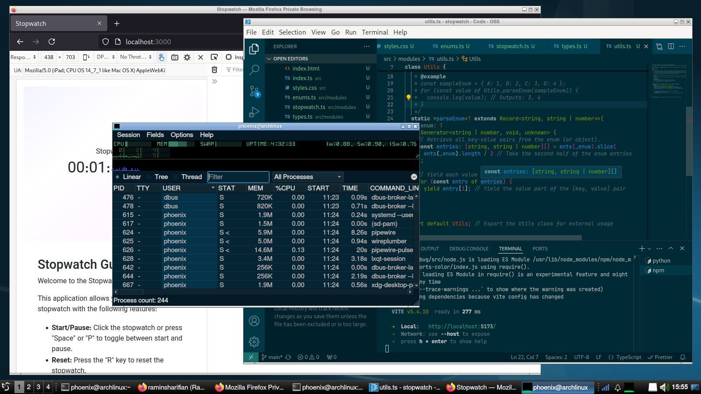

# Stopwatch Application

This is a simple stopwatch application built with TypeScript, which provides start, pause, reset functionality with automatic state saving in the browser's localStorage. The stopwatch can be controlled through mouse clicks or keyboard keybindings. It also supports smooth, animated updates of the time in the format `hh:mm:ss.sss`.

## Features

- **Start/Pause:** Toggle between start and pause by clicking the stopwatch or pressing "Space" or "P".
- **Reset:** Reset the stopwatch to 00:00:00.000 by pressing the "R" key.
- **Automatic State Saving:** The stopwatch state (elapsed time) is saved automatically to the browser's `localStorage`, so it persists even after page reloads.
- **Smooth Time Animation:** The stopwatch updates its display smoothly, showing hours, minutes, seconds, and milliseconds.
- **Customizable Keybindings:** You can modify the keybindings for controlling the stopwatch.

## Screenshots




## Project Structure

This project consists of the following files:

- **`src/`** - Source files for the project
  - **`enums.ts`**: Defines time units in milliseconds for conversion (e.g., hours, minutes, seconds).
  - **`stopwatch.ts`**: The main stopwatch logic (handles time calculation, animation, and state management).
  - **`types.ts`**: Defines the `ResMod` type for storing time division results (quotients and remainders).
  - **`utils.ts`**: Utility functions for parsing enums and handling other common tasks.
  - **`index.ts`**: Initializes and runs the stopwatch when the page loads.
  - **`styles.css`**: Styles the stopwatch UI, including animations and layout.
- **`index.html`**: The HTML file that includes the stopwatch and user guide.
- **`package.json`**: Project metadata, dependencies, and build scripts.

## Installation

### 1. Clone the repository:

```bash
git clone https://github.com/raminsharifian/stopwatch.git
cd stopwatch
```

### 2. Install dependencies:

```bash
npm install
```

### 3. Build and start the development server:

```bash
npm run dev
```

This will start a local server and you can open the application in your browser at `http://localhost:3000`.

## Usage

1. **Start/Pause the Stopwatch:**

   - Click on the stopwatch display.
   - Alternatively, press the "Space" or "P" key to toggle between start and pause.

2. **Reset the Stopwatch:**

   - Press the "R" key to reset the stopwatch to `00:00:00.000`.

3. **State Persistence:**
   - The stopwatch state (elapsed time) is saved in the browser’s `localStorage`. It will retain the time even if the page is refreshed or revisited.

## Customizing Keybindings

You can customize the keybindings used for controlling the stopwatch by modifying the `statusKeybindings` and `resetButton` options in the `Stopwatch` class constructor.

Example:

```ts
new Stopwatch("Stopwatch", element, true, 0, ["Space", "KeyS"], "KeyT");
```

In the above example:

- `"Space"` and `"KeyS"` will toggle between play and pause.
- `"KeyT"` will reset the stopwatch.

## Demo

Visit the live demo at [raminsharifian.github.io/stopwatch](https://raminsharifian.github.io/stopwatch) to see the stopwatch in action.

## Contributing

Feel free to fork the repository and submit pull requests if you'd like to contribute. For any issues or suggestions, please open an issue on the [GitHub repository](https://github.com/raminsharifian/stopwatch/issues).

## License

This project is licensed under the ISC License. See the [LICENSE](LICENSE) file for details.

## Acknowledgments

- `Bootstrap` for the styling framework.
- `CryptoJS` for MD5 hashing to create unique identifiers for each stopwatch.
- `Roboto` font for UI styling.
